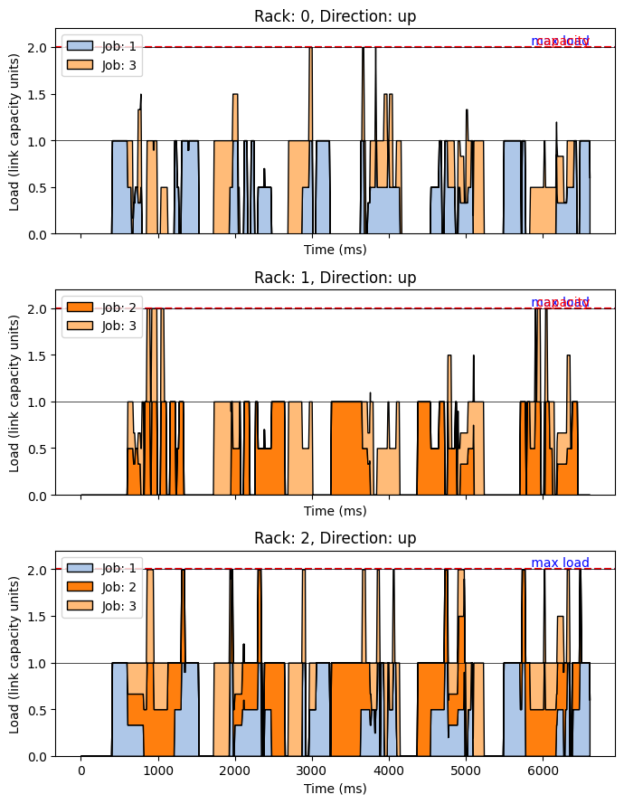
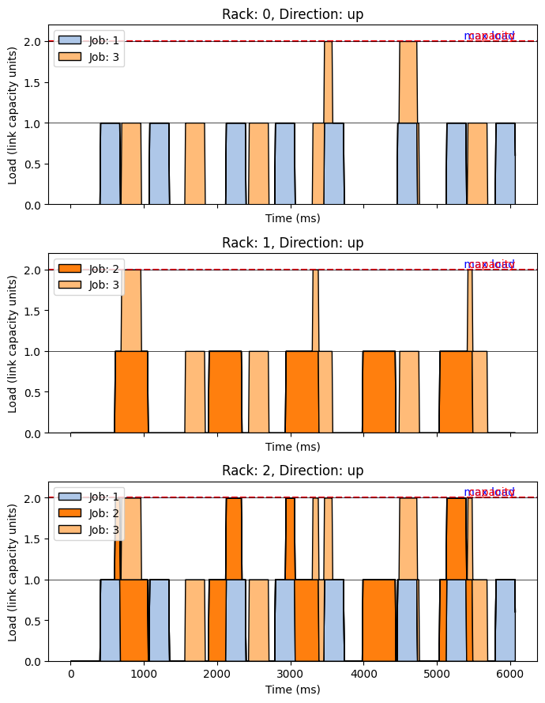
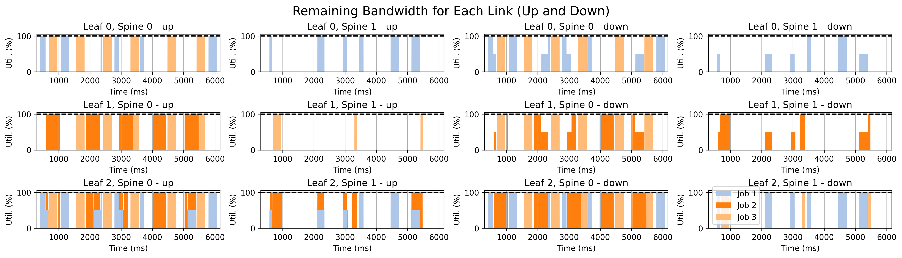
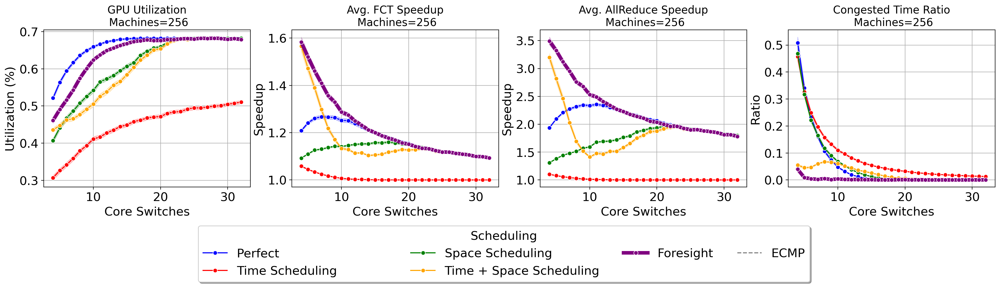

# PSIM

PSIM is a C++ simulator for evaluating distributed machine learning execution protocols under different network topologies and load-balancing strategies.

The simulator models protocol task graphs that combine compute tasks and communication flows, places them on simulated machines, routes flows through a configurable network, and reports completion time, flow-level metrics, utilization, and load-balancing decisions.

This repository also includes the experiment scripts used for the IFIP Networking 2025 paper:

> Foresight: Joint Time and Space Scheduling for Efficient Distributed ML Training

## What PSIM Simulates

PSIM represents a distributed ML workload as a dependency graph of tasks:

- **Compute tasks** execute on a machine or accelerator.
- **Flow tasks** transfer data between source and destination devices.
- **Empty tasks** act as graph markers, synchronizers, or logging points.

During simulation, PSIM advances active compute tasks and flows in discrete time steps. Network flows register their requested bandwidth on each bottleneck in their path, bottlenecks allocate bandwidth according to the configured allocator, and completed tasks trigger their dependent tasks.

## Main Features

- **Protocol simulation:** models compute tasks, communication flows, and dependency-driven execution.
- **Network modeling:** supports fat-tree, leaf-spine, and big-switch topologies with explicit bottlenecks.
- **Routing and load balancing:** includes random, ECMP, round-robin, least-loaded, power-of-k, replay-from-file, and protocol-defined routing modes.
- **Bandwidth allocation:** supports fair-share, max-min fair-share, fixed-level priority, and priority queue allocation.
- **Experiment execution:** runs repeated simulations with per-run logs, flow information, load-balancing decisions, and regret measurements.
- **Analysis workflow:** provides Python orchestration and plotting scripts for generating and processing paper-scale experiments.

## Repository Layout

The repository has two main parts:

- `src/` and `include/` contain the C++ simulator.
- `run/` contains the Python experiment orchestration, placement/routing helpers, and plotting scripts used by the paper experiments.

The most useful implementation entry points are:

- `src/main.cc` sets up command-line configuration, logging, repetitions, and per-run output directories.
- `src/psim.cc` owns the main simulation loop: starting tasks, advancing flows/compute, collecting history, and logging results.
- `src/protocol_builder.cc` builds protocol graphs either from input files or from generated experiment metadata.
- `src/network.cc` and `src/core_network.cc` implement the network models and bottlenecks.
- `src/loadbalancer.cc` implements routing and load-balancing policies.
- `include/gconfig.h` lists the runtime configuration fields populated by command-line options.

## Dependencies

PSIM currently expects:

- C++ build tools: a C++17 compiler, CMake, Boost Program Options, and Python development headers/libraries.
- Python packages for experiments and plotting: `matplotlib`, `numpy`, `pandas`, `networkx`, `seaborn`, and `scipy`.
- Git submodules: `deps/spdlog` and `deps/json`.

On Ubuntu-like systems, the base system dependencies are typically:

```bash
sudo apt-get update
sudo apt-get install -y cmake g++ libboost-all-dev python3-dev
python3 -m pip install matplotlib numpy pandas networkx seaborn scipy
```

## Cloning

Clone with submodules:

```bash
git clone --recursive git@github.com:FaridZandi/psim.git
cd psim
```

If the repository was already cloned without submodules:

```bash
git submodule update --init --recursive
```

This is required because the CMake build imports `deps/spdlog` and `deps/json`.

## Building

```bash
mkdir -p build
cd build
cmake ..
make -j
```

The build creates the `psim` executable under `build/`.

## Quick Start

From the build directory, run the simulator with a protocol input:

```bash
./psim \
  --protocol-file-dir ../input/128search \
  --protocol-file-name vgg128-simtime.txt \
  --network-type leafspine \
  --lb-scheme roundrobin \
  --rep-count 1 \
  --console-log-level 5
```

Output is written under the configured workers directory. By default, PSIM writes to:

```text
build/workers/worker-<worker-id>/run-<rep>/
```

The path above assumes the command is run from the `build/` directory.

Typical generated files include:

- `runtime.txt`
- `results.txt`
- `lb-decisions.txt`
- `regrets.txt`
- `flow-info.txt`

## Configuration

PSIM is configured through command-line flags that populate the global configuration object in `include/gconfig.h`.

The most important options are grouped below. For the complete list, run `./build/psim --help`.

### Workload and Protocol Options

| Option | Description |
| --- | --- |
| `--machine-count` | Number of machines/devices in the simulated cluster. |
| `--protocol-file-name` | Either an input file name or a built-in protocol builder name such as `nethint-test`. Multiple names can be comma-separated. |
| `--protocol-file-dir` | Directory used when `--protocol-file-name` refers to input files. |
| `--placement-file` | JSON placement file used by the runtime protocol builder. |
| `--timing-file` | Optional JSON timing/throttling file used by the runtime protocol builder. |
| `--routing-file` | JSON routing file used by generated protocols and `readprotocol` routing. |
| `--subflows` | Number of subflows to create for generated communication. |
| `--isolate-job-id` | Run only one job from a generated workload. |

### Network Options

| Option | Description |
| --- | --- |
| `--network-type` | Network model: `fattree`, `leafspine`, or `bigswitch`. |
| `--link-bandwidth` | Base link bandwidth. |
| `--ft-server-per-rack` | Number of servers per rack. |
| `--ft-rack-per-pod` | Number of racks per pod. |
| `--ft-agg-per-pod` | Number of aggregation switches per pod. |
| `--ft-pod-count` | Number of pods. |
| `--ft-core-count` | Number of core switches or spines. |
| `--ft-server-tor-link-capacity-mult` | Multiplier for server-to-ToR link capacity. |
| `--ft-tor-agg-link-capacity-mult` | Multiplier for ToR-to-aggregation link capacity. |
| `--ft-agg-core-link-capacity-mult` | Multiplier for aggregation-to-core link capacity. |
| `--gpu-per-machine` | Number of GPUs per machine in supported topologies. |
| `--gpu-gpu-link-capacity-mult` | Multiplier for intra-machine GPU link capacity. |

### Routing and Bandwidth Allocation

| Option | Description |
| --- | --- |
| `--lb-scheme` | Load-balancing policy: `random`, `roundrobin`, `ecmp`, `zero`, `readfile`, `readprotocol`, `leastloaded`, `powerofK`, `futureload`, `robinhood`, or `sita-e`. |
| `--lb-decisions-file` | File used by `readfile` load balancing. |
| `--ecmp-entropy-options` | Number of entropy choices used by ECMP. |
| `--load-metric` | Load signal used by load-aware policies: `flowsize`, `flowcount`, `utilization`, `allocated`, or `registered`. |
| `--priority-allocator` | Bottleneck allocator: `priorityqueue`, `fixedlevels`, `fairshare`, or `maxmin`. |
| `--bn-priority-levels` | Number of bottleneck priority levels. |
| `--initial-rate` | Initial flow sending rate. |
| `--min-rate` | Minimum flow sending rate. |
| `--rate-increase` | Multiplicative rate increase factor. |
| `--rate-decrease-factor` | Multiplicative rate decrease factor. |
| `--drop-chance-multiplier` | Multiplier used by probabilistic drop/congestion behavior. |
| `--punish-oversubscribed` | Enable oversubscription penalty behavior. |
| `--punish-oversubscribed-min` | Lower bound used by oversubscription penalty behavior. |

### Simulation and Output

| Option | Description |
| --- | --- |
| `--rep-count` | Number of repeated simulation runs. |
| `--step-size` | Fixed simulation time step. |
| `--adaptive-step-size` | Enable adaptive step sizing. |
| `--adaptive-step-size-min` | Minimum adaptive step size. |
| `--adaptive-step-size-max` | Maximum adaptive step size. |
| `--workers-dir` | Directory where per-run output is written. |
| `--worker-id` | Worker identifier used in output paths. |
| `--simulation-seed` | Base seed used for repeated runs. |
| `--console-log-level` | Console log verbosity. Higher values are quieter. |
| `--file-log-level` | File log verbosity. |
| `--core-status-profiling-interval` | Interval for recording core link status. |
| `--no-profile-core-status` | Disable core status profiling. |
| `--record-bottleneck-history` | Record bottleneck allocation history. |
| `--record-machine-history` | Record per-machine queue history. |
| `--print-flow-progress-history` | Record per-flow progress history. |
| `--export-dot` | Export protocol graph DOT files. |

The Python experiment scripts also maintain higher-level experiment settings such as placement mode, timing scheme, comparison name, and routing strategy. Those settings are used to generate the placement, timing, and routing files passed into the C++ simulator.

## Protocol Inputs

PSIM supports two ways to create protocol graphs.

### File-Based Protocols

The original path is to load a protocol file from `--protocol-file-dir`.

The file loader recognizes lines for:

- `Comm` communication tasks.
- `Forw` and `Back` compute tasks.
- `AllR` empty/synchronization tasks.

For this mode, `--protocol-file-name` is the file name, for example:

```bash
--protocol-file-dir ../input/128search \
--protocol-file-name vgg128-simtime.txt
```

### Runtime-Built Protocols

Most current experiments use the protocol builder instead of static protocol files. In this mode, `--protocol-file-name` names a built-in builder, and the simulator constructs the protocol graph at runtime.

The main experiment builder is:

```bash
--protocol-file-name nethint-test
```

`nethint-test` reads generated experiment metadata and creates the protocol graph inside `src/protocol_builder.cc`. The key inputs are:

- `--placement-file`: JSON description of jobs, machine assignments, communication size, compute size, layer count, and iteration count.
- `--timing-file`: optional JSON timing metadata with per-job iteration offsets and throttle rates.
- `--routing-file`: JSON routing metadata that maps generated flows to spines/cores and rates.

The Python scripts under `run/` generate these files before invoking `build/psim`. This is the path used by the paper sweeps: Python defines the experiment, produces placement/timing/routing artifacts, then launches the C++ simulator with `--protocol-file-name nethint-test`.

There are also smaller built-in protocol builders useful for debugging:

- `build-ring`
- `build-all-to-all`
- `periodic-test`
- `periodic-test-simple`

## Foresight Scheduling

The paper experiments evaluate Foresight as a coordinated scheduling pipeline rather than as a single load-balancing rule inside the simulator. The Python experiment layer generates a schedule, and the C++ simulator executes that schedule through runtime-built protocols.

At a high level, the workflow is:

1. Generate job placements and workload metadata.
2. Compute timing decisions that control when job iterations begin.
3. Compute routing decisions that assign generated flows to spines/cores.
4. Optionally split communication into subflows and search over throttle rates.
5. Run PSIM with `--protocol-file-name nethint-test` and `--lb-scheme readprotocol`.

The main scheduling components are represented in the experiment scripts by comparison names:

- **TS:** time scheduling. Generates per-job iteration offsets through the timing file.
- **RO:** routing optimization. Generates protocol-defined routing decisions consumed by `readprotocol`.
- **SUB:** subflow/throttle search. Splits communication and assigns throttle rates when multiple subflows are enabled.
- **REP / rounds:** iterative refinement variants controlled by settings such as `farid-rounds`.

In practice, the Foresight path uses the Python code under `run/` to create `placement-file`, `timing-file`, and `routing-file` artifacts, then invokes the C++ simulator to evaluate the resulting execution schedule. The simulator itself remains responsible for task execution, bottleneck bandwidth allocation, flow progress, and final metrics.

### Scheduling Progress Plots

The plots below show the same workload before and after Foresight's scheduling decisions. The baseline produces burstier link demand, while Foresight spreads communication over time and routes flows to reduce sustained contention.

<p align="center">
  
  
</p>

<p align="center">
  <em>Baseline runtime link load (left) and Foresight runtime link load (right).</em>
</p>

<!-- Foresight final scheduled demand: -->

<!--  -->

Additional routing diagnostics:

- [Merged routing ranges](docs/figures/foresight-progress/foresight-routing-merged-ranges.png)
- [Rack dependency graph](docs/figures/foresight-progress/foresight-routing-rack-dependency.png)

The remaining-capacity view below shows the state after routing scheduling. The useful property is that the routed flows fit within the available link capacity, so no link remains overloaded.



The final comparison summarizes the impact of these scheduling decisions against the other evaluated methods.



## Running Paper Experiments

The `run/` directory contains Python scripts for reproducing or extending the experiments.

From `run/`:

```bash
# Figure 5
python sweep-components-jobsizes.py
python sweep-components-oversub.py

# Figure 6
python sweep-placement.py

# Figure 7
python sweep-intensity.py
python sweep-topology.py
```

Experiment results are written under:

```text
run/results/exps/
```

The experiment scripts expect a built simulator at `build/psim` and may copy that binary into per-run result directories.

## Development Notes

This repository is research-oriented and contains several areas that are good candidates for cleanup:

- Modernize CMake target definitions and project metadata.
- Replace shell-based filesystem operations with `std::filesystem`.
- Move global configuration out of the singleton-style `GConf` object.
- Replace fixed-size job progress arrays with dynamically sized containers.
- Clarify the boundary between reusable simulator code and experiment-specific scripts.
- Document the protocol file format with a complete example.
- Add a small smoke-test input and a deterministic quick-start command.

## Current Status

PSIM is actively useful as a research simulator, but the repository still reflects its research-prototype history. The core simulator is implemented in C++, while experiment generation, execution, and plotting are handled by Python scripts under `run/`.

For new contributors, the best starting points are:

1. Build the simulator.
2. Run a single small protocol input.
3. Inspect the generated `results.txt` and `flow-info.txt`.
4. Follow one sweep script under `run/` to understand how large experiment batches are configured.
